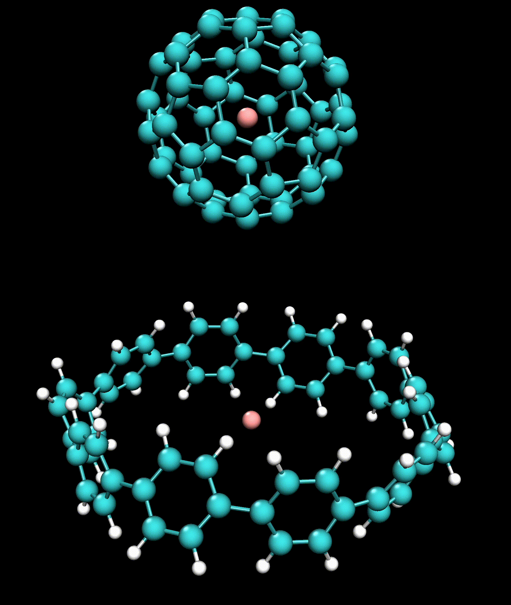

# int.Scan v1.0

Python code kit for generating input files of intermolecular rigid scan calculations.

## Usage

### 1. Necessary input files for int.Scan

(1) A *.txt* file including atom coordinates of two molecules, and scan information. An example is shown following, you can find this example file in the `/example` folder.

```
101 61 101 162 10 -1.33
 H                  2.87743800    6.17226100    2.06448600
 C                  3.41666700    5.88600900    1.16582400
 C                  4.76477800    5.02306500   -1.08527100
 C                  4.58285000    5.14083300    1.29223300
 C                  2.85882400    6.14752400   -0.09092800
 C                  3.62082800    5.79663600   -1.21185000
( . . . . . . )
 C                 -1.37202368    0.25836733   16.58099407
 C                  1.80309832   -3.02537363   13.07640301
 Bq                -0.00047997    0.00208209   13.33691324
```

In the first line, users need to give: (a) number of atoms in molecule A, (b) number of atoms in molecule B, (c) target atom in molecule A, (d) target atom in molecule B, (e) number of scan step, (f) step size of each scan. Then following with Cartesian coordinates of molecule A and B.

In this example, molecule A is **[10]CPP**, molecule B is **C60**. **[10]CPP** have 100 atoms with 1 Bq atom, total 101 atom, and **C60** have 61 atoms since 1 Bq atom also be included. We want to scan the distance between two Bq atoms (atoms number: 101 and 162) in 10 steps with -1.33 step size.

(2) A *.txt* file including Gaussian calculation setup.
```
%nprocshared=8
%mem=10GB
%chk=
#p rb3lyp/6-31g(d) counterpoise=2
0 1 0 1 0 1
```

Users can specify the CPU cores, memory, routine line, charge and spin multiplicity. If you want to keep checkpoint file, please include `%chk=` in this file (you don't need to write the checkpoint file name here).

### 2. Generate Gaussian input files

Run int.Scan from *Terminal*, make sure file (1) and (2) in step 1 are in the same directory. Input the file location of file (1), and press ENTER, the Gaussian input files and a *.xyz* file including the geometries of each scan step would be saved in the same location as the *.txt* files.

```
*******************************************************************************
*                                                                             *
*                               i n t . S c a n                               *
*                                                                             *
*     ====================== Version 1.0 for macOS ======================     *
*                          Release date: 2022-01-30                           *
*                                                                             *
*                             -- Catch me with --                             *
*                         E-mail  wongzit@yahoo.co.jp                         *
*                       Homepage  https://wongzit.github.io                   *
*                                                                             *
*******************************************************************************

PRESS Ctrl+c to exit the program.

int.Scan input file (.txt):
(e.g.: /intScan/examples/10cpp_c60.txt)
/Users/wangzhe/Desktop/10cpp_c60/10cpp_c60.txt
```

The trajectory of **C60** in **[10]CPP**:


## Comments

### About BSSE
If BSSE (`counter=2` or `counterpoise=2`) is included in file (2), the fragment data will also be included in the generated Gaussian input files.

**With BSSE:**
```
H(Fragment=1)                 -4.944644    -4.906682    -2.289024
H(Fragment=1)                 -2.877416    -6.172317    -2.064427
H(Fragment=1)                 -3.265775    -6.050711    2.206495
C(Fragment=2)                 -1.80485887    3.02852116    4.28662042
C(Fragment=2)                 -1.88434133    2.51907695    5.64214841
C(Fragment=2)                 -0.74835384    2.47866864    6.4353001
```
**Without BSSE:**
```
H                 -4.944644    -4.906682    -2.289024
H                 -2.877416    -6.172317    -2.064427
H                 -3.265775    -6.050711    2.206495
C                 -1.80485887    3.02852116    4.28662042
C                 -1.88434133    2.51907695    5.64214841
C                 -0.74835384    2.47866864    6.4353001
```

### About Bq atom
If Bq atoms are included in file (1), the generated Gaussian input files would delete these Bq atoms, but Bq atoms would be remain in the generated *.xyz* file.

### Extracting Energy from Gaussian output files
For single point energy calculations, users can use int.Scan(enex) script to extracting electronic energies in each step. The source code could be found in this repo.

### Check termination information
Users can use int.Scan(chkend) to check whether the calculations were terminated normally.

